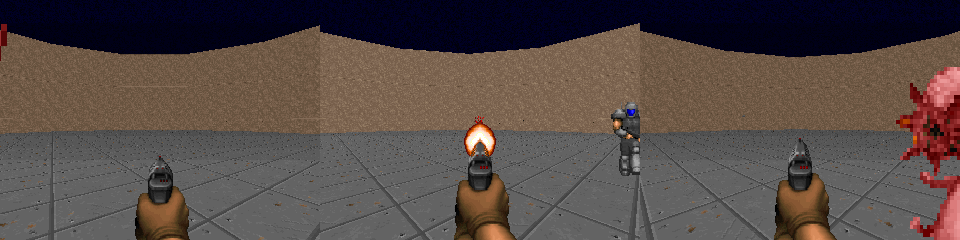

# VizDoom Deep Reinforcement Learning Agent

Training multiple agents to play Doom on the DefendCenterv1 scenario using [stable-baselines3](https://github.com/DLR-RM/stable-baselines3).  
Testing 3 different learning algorithms:
- [PPO](https://stable-baselines3.readthedocs.io/en/master/modules/ppo.html)
- [DQN](https://stable-baselines3.readthedocs.io/en/master/modules/dqn.html)
- [A2C](https://stable-baselines3.readthedocs.io/en/master/modules/a2c.html)

It uses an Agentic AI layer to find the most performant hyperparameters.




## Installation

- Install [uv](https://github.com/astral-sh/uv) package manager.

## Running 

These commands will run training and when complete evaluate the agent for a final time.  
The script will save the most performant model as it goes.  
It uses whatever accelerator is available - GPU, CPU.  
The weights, evaluations and logs are all saved to the specified folders.  
All configuration is in a .env file.  

### Train & Watch

All configurable environment variables can be found in [train.py](train.py).  
This will run training and show a configurable period of watching the agent play with the learnt policy.  
```bash
ENV=.env make train
```

### Agentic AI

All configurable environment variables and experiments can be found in [agentic_train.py](agentic_train.py).  

```bash
ENV=.env make agentic-train
```

## Results

Evaluations on the algorithms are available [here](./analysis.ipynb).

